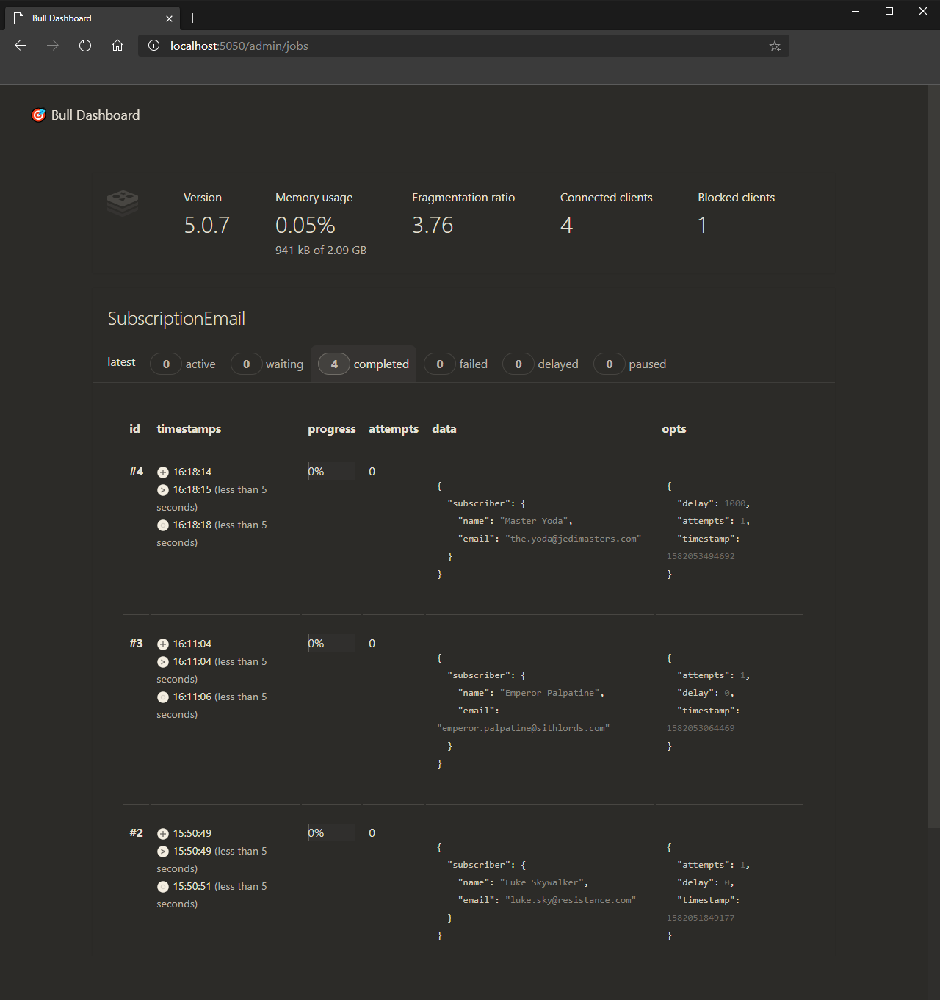

# Job Scheduler


>This project was a boilerplate creation for a Job Scheduling microservice integrated with Redis. Feel free to use it and modify as you wish.
---
**Technologies used:** 

* Node.js
* Redis
* Bull
* Bull Board
* DotEnv  
* Express  
* Nodemailer
* Sucrase
* Nodemon
* Npm-run-all  

---
**Configuration:**

After cloning the respository, install the dependencies:

```
yarn install
```
or
```
npm install
```

Then proceed with the creation of your .Env file to store your environment variables, for Redis and your chosen mail solution:

```c#
# Mail Environment Variables

MAIL_HOST=***
MAIL_PORT=***
MAIL_USER=***
MAIL_PASS=***

# Redis Environment Variables

REDIS_HOST=***
REDIS_PORT=***
```

I used **Docker** to instantiate my Redis solution, [Try it here!](https://www.docker.com/)

If you opt for docker, here's the Redis version i've used for this project:

```
docker run --name redis -p 6379:6379 -d -t redis:alpine
```
---
**Usage:**

If you want to test using the same rest client i've used with my settings, you can click the button below:

[](https://insomnia.rest/run/?label=Job%20Scheduler&uri=https%3A%2F%2Fraw.githubusercontent.com%2Farthurdiegoo%2FJob-Scheduler%2Fmaster%2Fassets%2Frest_client%2FInsomnia_2020-02-18.json)

The server should run both the queue scheduler and the server itself utilizing: 

```
yarn dev
```
or
```
npm dev
```

---
**Bull Board:**

I've added also an option of Admin Dashboard built in the Bull package, it's called Bull Board and it's a good tool to have in hand.



**Important:** If you opt for utilizing the Bull Board remember to add authentication to your admin/jobs route, otherwise any user should be able to see all your job entries.